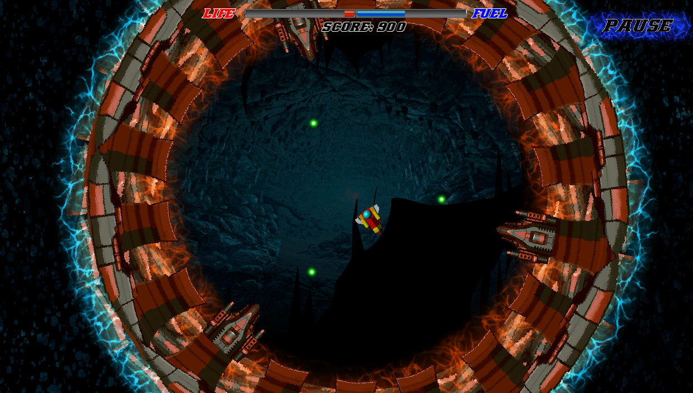

# Non Gravitar - Progetto del corso di Programmazione dell'Università di Bologna A.A. 2018/19
NonGravitar è un progetto del corso di programmazione dell'anno 2018-2019.
Scopo principale del progetto è stato quello di ricreare una versione del gioco Gravitar sviluppato da Atari, in una versione semplificata.
Questa versione è stata sviluppata da Davide Tinti, Paolo Marzolo e Matteo Feroli.

## Il gioco
L'obbiettivo principale del gioco è quello di totalizzare punti distruggendo i nemici situati all'interno dei pianeti.
Il giocatore impersona una navicella spaziale che viaggia tra sistemi solari e atterrando sui diversi pianeti troverà differenti nemici da sconfiggere.
La partita finisce quando il carburante o la vita del giocatore termina.

## Comandi
| Tasto             | Descrizione                       |
|-------------------|-----------------------------------|
| Freccia Sinistra  | Ruota la nave in senso antiorario |
| Freccia Destra    | Ruota la nave in senso orario     |
| Barra Spaziatrice | Accelera                          |
| S                 | Spara proiettile                  |
| L                 | Spara laser                       |
| F                 | Raggio Traente                    |

## Compilazione
NonGravitar utilizza [SFML](https://www.sfml-dev.org/), quindi è necessario installarla prima di compilare il progetto.
All'interno di `src` è presente un makefile che espone due regole:
- `make` compila il progetto per linux, lasciando l'eseguibile `nongravitar` nella cartella `src` e i file compilati in `obj`
- `make clean` elimina l'eseguibile e la cartella `obj`
Per la compilazione per altre architetture suggeriamo la [pagina dedicata](https://www.sfml-dev.org/tutorials/2.5/) di SFML.

## Screenshots

